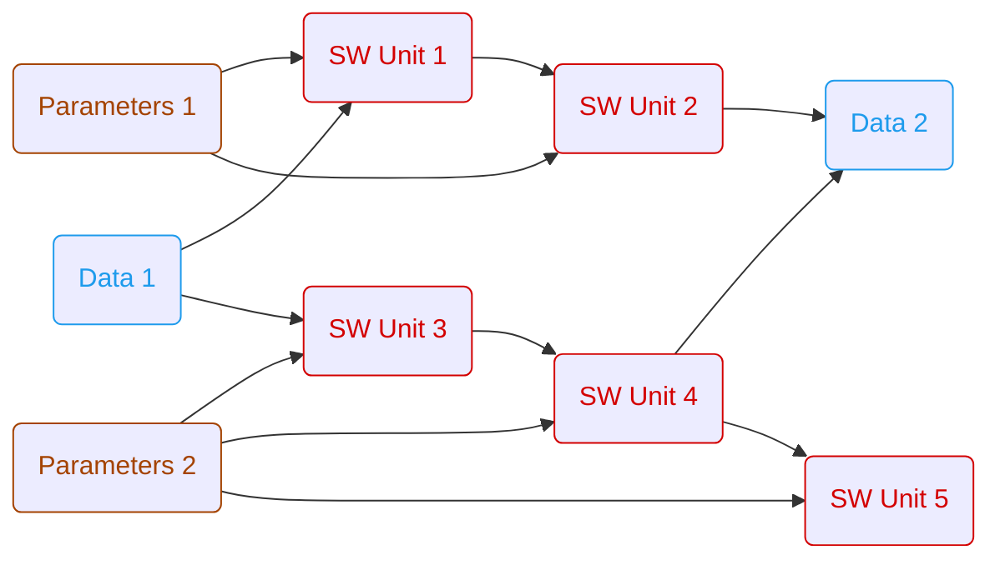

# ARES
The **A**utomated **R**apid **E**mbedded **S**imulation project is a tool for performing open- and closed-loop simulations of software components. The primary application area is the development of software components for embedded applications.

We are committed to a welcoming and inclusive community. Please read our [Code of Conduct](https://github.com/AndraeCarotta/ARES/blob/master/CODE_OF_CONDUCT.md) before contributing.

* [1. Installation](#1-installation)
* [2. Architecture](#2-architecture)
* [3. Bug & Feature Report](#3-get-in-touch-with-us)
* [4. Contributing](#4-contribution-to-the-ares-project)
* [5. Workflows](#5-workflows)
    * [5.1. General Workflow Rules](#51-general-workflow-rules)
    * [5.2. Workflow Elements](#52-workflow-elements)
    * [5.3. Example Workflows](#53-example-workflows)
* [6. Examples](#6-examples)
* [7. License](#7-license)

## 1. Installation

ARES is currently under active development. Therefore no compiled program exists. 
To use ARES until the first release or for development the recommended way to use ARES is via a python virtual environment.
To simplify the process of creating and configuring the virtualenv the following make command can be used:

```bash
make setup-venv
``` 

What the make command does:
- creating virtual environment in directory '.venv'
- installing project dependencies from 'pyproject.toml'

**⚠️ NOTE:** Currently ARES is only supported for Linux.

## 2. Architecture

ARES is built on a four-layer architecture that enables flexible, extensible simulation workflows:

1. **Orchestration** - Pipeline orchestrates workflow execution from JSON definitions
2. **Plugins** - Extensible processing units (SimUnit for C/C++ simulations, custom plugins)
3. **Interfaces** - Format-agnostic I/O with automatic handler selection and caching
4. **Base Types** - Core data structures (Signal, Parameter)

The architecture uses design patterns like **Flyweight** (hash-based caching), **Factory** (automatic format detection), and **Strategy** (pluggable handlers) to achieve high performance and maintainability.

📖 **For detailed architecture documentation** including system diagrams, class structures, and design decisions, see [architecture.md](./architecture.md).

## 3. Get in touch with us

- [Support Request](https://github.com/AndraeCarotta/ares/issues/new?template=support_request.md)
- [Bug Report](https://github.com/AndraeCarotta/ares/issues/new?template=bug_report.md)
- [Feature Request](https://github.com/AndraeCarotta/ares/issues/new?template=feature_request.md)

## 4. Contribution to the ares project

To contribute to the ARES project, please see the [CONTRIBUTING.md](https://github.com/AndraeCarotta/ARES/blob/master/CONTRIBUTING.md) file for details.

## 5. Workflows

### 5.1. General Workflow Rules

TODO: Workflows have to be implemented like...
- a workflow should never have more than one data element as a sink (if you need more => write a feature)

### 5.2. Workflow Elements

#### data

TODO: Reading and writing data sources in different file formats (currently only mf4 is implemented)

#### parameter

TODO: Reading and writing datasets in different file formats (currently only dcm is implemented)

#### sim_unit

TODO: Simulation unit of some software. Could be an executable, fmu,...

#### custom

TODO: e.g. Optimization, Plotting, Testing

### 5.3. Example Workflows

#### Open-Loop Simulation



## 6. Examples

For a detailed explanation of the example applications, please refer to [README.md](https://github.com/AndraeCarotta/ARES/blob/master/examples/README.md).

## 7. License

This project is licensed under the Apache License 2.0 — see the [LICENSE](https://github.com/AndraeCarotta/ARES/blob/master/LICENSE) file for details.

### Third-Party Dependencies

This project includes or depends on third-party software components. All dependencies and their respective licenses are documented in the [NOTICE](https://github.com/AndraeCarotta/ARES/blob/master/NOTICE) file in accordance with Apache License 2.0 requirements.

Copyright 2025 Andrä Carotta

Licensed under the Apache License, Version 2.0 (the "License");
you may not use this file except in compliance with the License.
You may obtain a copy of the License at

    http://www.apache.org/licenses/LICENSE-2.0

Unless required by applicable law or agreed to in writing, software
distributed under the License is distributed on an "AS IS" BASIS,
WITHOUT WARRANTIES OR CONDITIONS OF ANY KIND, either express or implied.
See the License for the specific language governing permissions and
limitations under the License.
