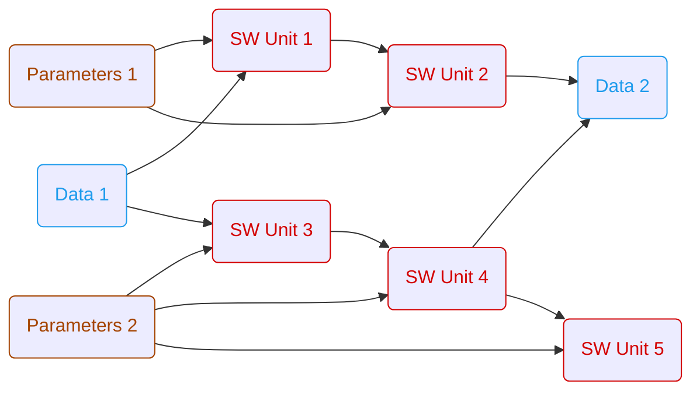

# ARES
The **A**utomated **R**apid **E**mbedded **S**imulation project is a tool for performing open- and closed-loop simulations of software components. The primary application area is the development of software components for embedded applications.

ARES is licensed under the MIT License — see the [LICENSE.md](https://github.com/AndraeCarotta/ARES/blob/master/LICENSE) file for details.
We are committed to a welcoming and inclusive community. Please read our [Code of Conduct](https://github.com/AndraeCarotta/ARES/blob/master/CODE_OF_CONDUCT.md) before contributing.

* [1. Installation](#1-installation)
* [2. Bug & Feature Report](#2-send-us-an-issue)
* [3. Contributing](#3-contribution-to-the-ares-project)
* [4. Workflows](#4-workflows)
    * [4.1. General Workflow Rules](#41-general-workflow-rules)
    * [4.2. Function Blocks](#42-function-blocks)
    * [4.3. Example Workflows](#43-example-workflows)
* [5. Examples](#5-examples)

## 1. Installation

ARES is currently under active development. Therefore no compiled program exists. 
To use ARES until the first release or for development the recommended way to use ARES is via a python virtual environment.
To simplify the process of creating and configuring the virtualenv the following make command can be used:

```bash
make setup_venv
``` 

What the make command does:
- creating virtual environment in directory '.venv'
- installing project dependencies from 'pyproject.toml'

**⚠️ NOTE:** Currently ARES is only supported for Linux.

## 2. Get in touch with us

- [Support Request](https://github.com/AndraeCarotta/ares/issues/new?template=support_request.md)
- [Bug Report](https://github.com/AndraeCarotta/ares/issues/new?template=bug_report.md)
- [Feature Request](https://github.com/AndraeCarotta/ares/issues/new?template=feature_request.md)

## 3. Contribution to the ares project

To contribute to the ARES project, please see the [CONTRIBUTING.md](https://github.com/AndraeCarotta/ARES/blob/master/CONTRIBUTING.md) file for details.

## 4. Workflows

### 4.1. General Workflow Rules

TODO: Workflows have to be implemented like...
- a workflow should never have more than one data element as a sink (if you need more => write a feature)

### 4.2. Workflow Elements

#### data

TODO: Reading and writing data sources in different file formats (currently only mf4 is implemented)

#### parameter

TODO: Reading and writing datasets in different file formats (currently only dcm is implemented)

#### sim_unit

TODO: Simulation unit of some software. Could be an executable, fmu,...

#### custom

TODO: e.g. Optimization, Plotting, Testing

### 4.3. Example Workflows

#### Open-Loop Simulation



## 5. Examples

For a detailed explanation of the example applications, please refer to [README.md](https://github.com/AndraeCarotta/ARES/blob/master/examples/README.md).
