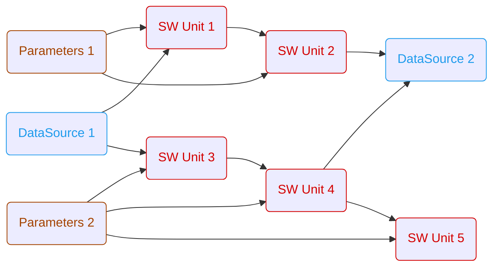

# ARES
The Automated Rapid Embedded Simulation project is a tool to do open- and closed loop simulations of software components. The primary application area is the development of software components for embedded applications. 

The ares project is licensed under the MIT License - see the [LICENSE.md](https://github.com/AndraeCarotta/ARES/blob/master/LICENSE) file for details.

* [1. Installation](#1-installation)
* [2. Bug & Feature Report](#2-send-us-an-issue)
* [3. Contributing](#3-contribution-to-the-ares-project )
* [4. Workflows](#4-workflows)
    * [4.1. General Workflow Rules](#41-general-workflow-rules)
    * [4.2. Function Blocks](#42-function-blocks)
    * [4.3. Example Workflows](#43-example-workflows)
* [5. Examples](#5-examples)

## 1. Installation

- Windows: execute [install.bat](install.bat)
- Linux: execute [install.sh](install.sh)

## 2. Send us an issue

- [bug report template](https://github.com/AndraeCarotta/ares/issues/new?template=bug_report.md)
- [feature request template](https://github.com/AndraeCarotta/ares/issues/new?template=feature_request.md)

## 3. Contribution to the ares project

To contribute on the ares project please see the [CONTRIBUTING.md](https://github.com/AndraeCarotta/ARES/blob/master/CONTRIBUTING.md) file for details.

## 4. Workflows

### 4.1. General Workflow Rules

TODO: Workflows have to be implemented like...

### 4.2. Workflow Elements

#### data_source

TODO: Reading and writing data sources in different file formats (currently only mf4 is implemented)

#### parameters

TODO: Reading and wrtiging datasets in different file formats (currently onfly dcm is implemented)

#### sim_unit

TODO: Simulation unit of some software. Could be a executable, fmu,...

#### custom

TODO: e.g. Optimization, Plotting, Testing

### 4.3. Example Workflows

#### Open-Loop Simulation

## 5. Examples

TODO: how to compile and start an example