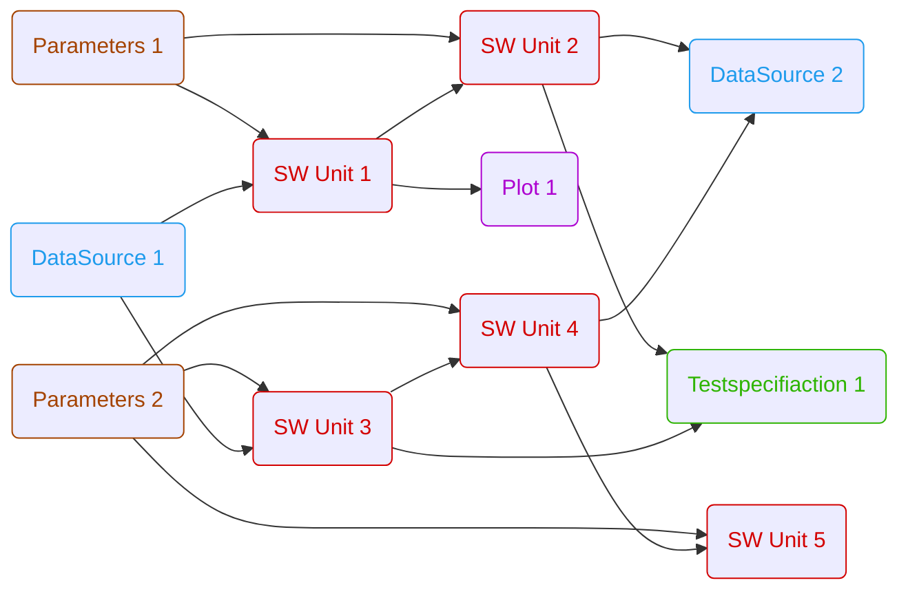

# ARES
Automated Rapid Embedded Simulation

* [Installation](#installation)
    * [Windows](#windows)
    * [Linux](#linux)
* [Bug & Feature Report](#send-us-an-issue)
    * [Bug Report](#bug-report)
    * [Feature Request](#feature-request)
* [Workflows](#workflows)
    * [General Workflow Rules](#general-workflow-rules)
    * [Function Blocks](#function-blocks)
    * [Example Workflows](#example-workflows)

## Installation

Windows:
- execute [install.bat](install.bat)

Linux:
- execute [install.sh](install.sh)

## Send us an issue

Use this templates to report us your tasks:
- [Bug_Report](https://github.com/AndraeCarotta/ARES/issues/new?template=bug_report.md)
- [Feature_Request](https://github.com/AndraeCarotta/ARES/issues/new?template=feature_request.md)

## Workflows

### General Workflow Rules

TODO: Workflows have to be implemented like...

### Workflow Elements

#### data_source

TODO: Reading and writing data sources in different file formats (currently only mf4 is implemented)

#### parameters

TODO: Reading and wrtiging datasets in different file formats (currently onfly dcm is implemented)

#### sim_unit

TODO: Simulation unit of some software. Could be a executable, fmu,...

#### custom

TODO: e.g. Optimization, Plotting, Testing

### Example Workflows

#### Open-Loop Simulation

