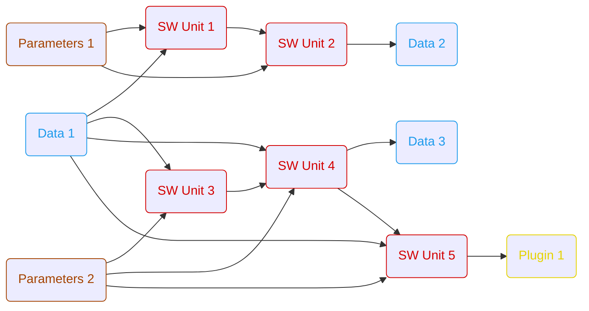

# ARES
The **A**utomated **R**apid **E**mbedded **S**imulation project is a tool for performing open- and closed-loop simulations of software components. The primary application area is the development of software components for embedded applications.

We are committed to a welcoming and inclusive community. Please read our [Code of Conduct](https://github.com/olympus-tools/ARES/blob/master/CODE_OF_CONDUCT.md) before contributing.

* [1. Installation](#1-installation)
* [2. Usage](#2-usage)
* [3. Architecture](#3-architecture)
* [4. Bug & Feature Report](#4-get-in-touch-with-us)
* [5. Contributing](#5-contribution-to-the-ares-project)
* [6. Workflows](#6-workflows)
    * [6.1. General Workflow Rules](#61-general-workflow-rules)
    * [6.2. Workflow Elements](#62-workflow-elements)
* [7. Examples](#7-examples)
    * [7.1. Open-Loop Simulation](#71-open-loop-simulation)
    * [7.2. Detailed Examples](#72-detailed-examples)
* [8. Future Developments](#8-future-developments)
* [9. License](#9-license)

## 1. Installation

ARES is currently under active development and is distributed as a source package. The recommended way to use ARES is within a Python virtual environment.

### 1.1. Prerequisites

Before setting up ARES, ensure your system meets the following requirements:

*   **Operating System**: Linux (currently the only supported OS)
*   **Python**: Version 3.12 or higher
*   **Build Tools**: `make` (only required for **Option A: Automated Setup**)

### 1.2. Installation in Virtual Environment (Recommended)

Using a virtual environment is recommended to avoid conflicts with system packages. You can set this up automatically or manually.

#### Option A: Automated Setup (via Makefile)

1.  **Clone the repository:**
    ```bash
    git clone https://github.com/olympus-tools/ARES.git
    cd ares
    ```

2.  **Create and configure the environment:**
    This command creates a `.venv` directory and installs dependencies:
    ```bash
    make setup-venv
    ```

3.  **Activate the environment:**
    ```bash
    source .venv/bin/activate
    ```

#### Option B: Manual Setup

If you prefer to configure the virtual environment manually:

1.  **Create a virtual environment:**
    ```bash
    python3 -m venv .venv
    ```

2.  **Activate the environment:**
    ```bash
    source .venv/bin/activate
    ```

3.  **Install ARES:**
    ```bash
    pip install .
    ```

### 1.3. Installation in System Python

You can also install ARES directly into your global Python environment. Note that this might require `sudo` permissions and could conflict with other packages.

1.  **Navigate to the project root:**
    ```bash
    cd ares
    ```

2.  **Install the package:**
    For standard installation:
    ```bash
    pip install .
    ```
    For development (editable mode):
    ```bash
    pip install -e .
    ```

## 2. Usage

ARES is primarily used via its Command Line Interface (CLI). The main command is `pipeline`, which executes a simulation workflow defined in a JSON file.

### Basic Command

```bash
python -m ares pipeline --workflow <path_to_workflow.json> [OPTIONS]
```

### Options

| Option | Short | Description | Required | Default |
| :--- | :--- | :--- | :--- | :--- |
| `--workflow` | `-wf` | Path to the workflow JSON file. | Yes | - |
| `--output` | `-o` | Directory where output files will be saved. | No | Workflow directory |
| `--log-level` | | Logging verbosity (10=DEBUG, 20=INFO, 30=WARNING, 40=ERROR). | No | 20 (INFO) |

### Example

```bash
python -m ares pipeline -wf ./my_workflow.json -o ./results --log-level 10
```

## 3. Architecture

ARES is built on a four-layer architecture that enables flexible, extensible simulation workflows:

1. **Orchestration** - Pipeline orchestrates workflow execution from JSON definitions
2. **Plugins** - Extensible processing units (SimUnit for C/C++ simulations, custom plugins)
3. **Interfaces** - Format-agnostic I/O with automatic handler selection and caching
4. **Base Types** - Core data structures (Signal, Parameter)

The architecture uses design patterns like **Flyweight** (hash-based caching), **Factory** (automatic format detection), and **Strategy** (pluggable handlers) to achieve high performance and maintainability.

📖 **For detailed architecture documentation** including system diagrams, class structures, and design decisions, see [architecture.md](./architecture.md).

## 4. Get in touch with us

- [Support Request](https://github.com/olympus-tools/ARES/issues/new?template=support_request.md)
- [Bug Report](https://github.com/olympus-tools/ARES/issues/new?template=bug_report.md)
- [Feature Request](https://github.com/olympus-tools/ARES/issues/new?template=feature_request.md)

## 5. Contribution to the ares project

To contribute to the ARES project, please see the [CONTRIBUTING.md](https://github.com/olympus-tools/ARES/blob/master/CONTRIBUTING.md) file for details.

## 6. Workflows

### 6.1. General Workflow Rules

ARES pipelines are defined using a JSON file, referred to as a **Workflow**. The workflow structure is a dictionary where:
*   **Keys**: Unique identifiers (names) for each workflow element.
*   **Values**: Configuration objects defining the element's properties.

Elements can define dependencies on other elements. The ARES pipeline analyzes these dependencies to determine the correct execution order automatically.

### 6.2. Workflow Elements

Each element in the workflow must adhere to a specific schema defined by the ARES Pydantic models. The `type` field is mandatory and determines the validation rules.

#### Data Element (`type="data"`)

Handles time-dependent signal data (e.g., measurement files, time-series). These signals are typically fed into simulation units step-by-step during execution.

| Field              | Required   | Type        | Supported Values    | Description                                         |
| :----------------- | :--------- | :---------- | :------------------ | :-------------------------------------------------- |
| `type`             | Yes        | `str`       | `"data"`            | Unique identifier for the element type.             |
| `mode`             | Yes        | `str`       | `"read"`, `"write"` | Operation mode.                                     |
| `file_path`        | If `read`  | `list[str]` |                     | Path(s) to input data files (e.g., `.mf4`).         |
| `input`            | If `write` | `list[str]` |                     | List of element names to write to file.             |
| `output_format`    | If `write` | `str`       | `"mf4"`             | Target file format.                                 |
| `label_filter`     | No         | `list[str]` |                     | Filter specific signals by name.                    |
| `stepsize`         | No         | `int`       |                     | Resampling step size in ms.                         |

#### Parameter Element (`type="parameter"`)

Handles parameter sets that remain constant throughout the simulation duration. These are used to configure, trim, or calibrate software components (e.g., characteristic curves, scalar values).

| Field              | Required   | Type        | Supported Values    | Description                                         |
| :----------------- | :--------- | :---------- | :------------------ | :-------------------------------------------------- |
| `type`             | Yes        | `str`       | `"parameter"`       | Unique identifier for the element type.             |
| `mode`             | Yes        | `str`       | `"read"`, `"write"` | Operation mode.                                     |
| `file_path`        | If `read`  | `list[str]` |                     | Path(s) to parameter files (e.g., `.dcm`, `.json`). |
| `parameter`        | If `write` | `list[str]` |                     | List of element names to write to file.             |
| `output_format`    | If `write` | `str`       | `"dcm"`, `"json"`   | Target file format.                                 |
| `label_filter`     | No         | `list[str]` |                     | Filter specific parameters by name.                 |

#### Simulation Unit (`type="sim_unit"`)

Executes a compiled dynamic library (e.g., `.dll`, `.so`). This can represent any software component, such as a controller algorithm or a physical plant model.

| Field              | Required   | Type        | Supported Values    | Description                                         |
| :----------------- | :--------- | :---------- | :------------------ | :-------------------------------------------------- |
| `type`             | Yes        | `str`       | `"sim_unit"`        | Unique identifier for the element type.             |
| `file_path`        | Yes        | `str`       |                     | Path to the compiled library (`.dll`, `.so`).       |
| `data_dictionary`  | Yes        | `str`       |                     | Path to the data dictionary definition.             |
| `stepsize`         | Yes        | `int`       |                     | Simulation step size in ms.                         |
| `input`            | Yes        | `list[str]` |                     | List of data element names providing inputs.        |
| `parameter`        | No         | `list[str]` |                     | List of parameter element names.                    |
| `init`             | No         | `list[str]` |                     | List of elements for initialization.                |
| `cancel_condition` | No         | `str`       |                     | Expression to stop simulation early.                |

#### Custom Plugin (`type="plugin"`)

Allows users to execute custom Python scripts within the workflow. Plugins can depend on other elements or serve as dependencies for others. They are versatile and can be used for tasks such as data manipulation, optimization loops, plotting, or automated testing.

| Field              | Required   | Type        | Supported Values    | Description                                         |
| :----------------- | :--------- | :---------- | :------------------ | :-------------------------------------------------- |
| `type`             | Yes        | `str`       | `"plugin"`          | Unique identifier for the element type.             |
| `file_path`        | Yes        | `str`       |                     | Path to the Python plugin script.                   |
| *Custom*           | No         | `Any`       |                     | Additional fields as required by the plugin.        |

## 7. Examples

### 7.1. Open-Loop Simulation

The following diagram illustrates an example of an open-loop simulation workflow. It demonstrates how parameters and data are fed into simulation units, and how the output of one unit can serve as input for another.



### 7.2. Detailed Examples

For a detailed explanation of the example applications, please refer to [README.md](https://github.com/olympus-tools/ARES/blob/master/examples/README.md).

## 8. Future Developments

ARES is constantly evolving. Future developments will focus on:
*   **Closed-Loop Simulation**: Enabling feedback loops where the output of a simulation unit influences its own input in subsequent steps.
*   **Expanded Simulation Support**: Integration of the FMI standard to support Functional Mock-up Units (FMUs).
*   **Additional Data File Formats**: Support for more data formats (e.g., Parquet, MAT). Note that data sets can temporarily only be output as JSON.
*   **Parameter Support**: Enabling writing of DCM parameter files (currently not possible).
*   **Enhanced Plugin System**: More built-in plugins for common tasks like plotting and reporting.
*   **Performance Optimization**: Parallel execution of independent workflow branches.

## 9. License

This project is licensed under the Apache License 2.0 — see the [LICENSE](https://github.com/olympus-tools/ARES/blob/master/LICENSE) file for details.

### Third-Party Dependencies

This project includes or depends on third-party software components. All dependencies and their respective licenses are documented in the [NOTICE](https://github.com/olympus-tools/ARES/blob/master/NOTICE) file in accordance with Apache License 2.0 requirements.

Licensed under the Apache License, Version 2.0 (the "License");
you may not use this file except in compliance with the License.
You may obtain a copy of the License at

    http://www.apache.org/licenses/LICENSE-2.0

Unless required by applicable law or agreed to in writing, software
distributed under the License is distributed on an "AS IS" BASIS,
WITHOUT WARRANTIES OR CONDITIONS OF ANY KIND, either express or implied.
See the License for the specific language governing permissions and
limitations under the License.
