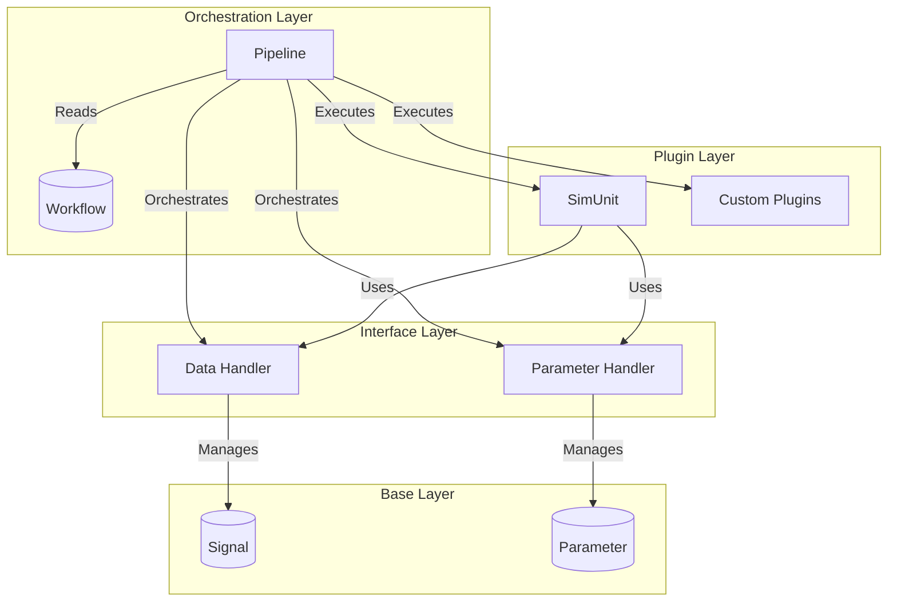
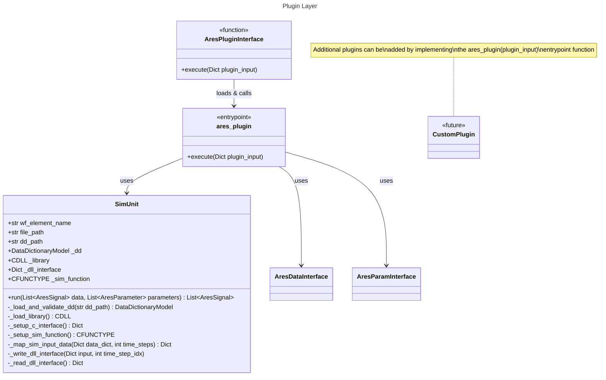
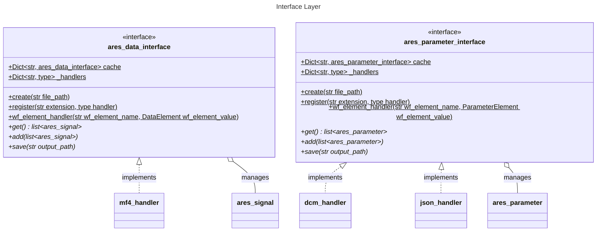
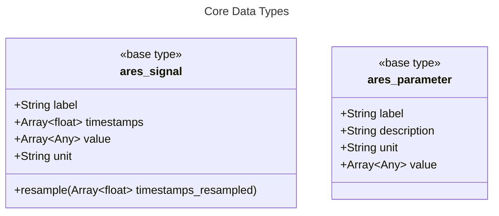

# ARES Architecture

## Table of Contents

1. [Overview](#1-overview)
2. [System Architecture](#2-system-architecture)
3. [Class Structure](#3-class-structure)
   - 3.1 [Orchestration Layer](#31-orchestration-layer)
   - 3.2 [Plugin Layer](#32-plugin-layer)
   - 3.3 [Interface Layer](#33-interface-layer)
   - 3.4 [Base Types](#34-base-types)
4. [Key Design Decisions](#4-key-design-decisions)

---

## 1. Overview

ARES (Automated Rapid Embedded Simulation) is structured in four main layers:
1. **Orchestration** - Pipeline and workflow execution
2. **Base Types** - Core data structures (signal, parameter)
3. **Interfaces** - File I/O and data management
4. **Plugins** - Processing and transformation logic

---

## 2. System Architecture

**Architecture Layers:**
1. **Orchestration**: Pipeline executes workflow definitions
2. **Plugin**: Processes data using loaded interfaces
3. **Interface**: Manages I/O with flyweight caching
4. **Base**: Fundamental data structures

---

## 3. Class Structure

### 3.1 Orchestration Layer

**Orchestration Flow:**
1. Pipeline loads Workflow from JSON file
2. Identifies workflow sinks (end points)
3. Iterates through workflow elements in dependency order
4. Dispatches to appropriate handlers (parameter, data, plugin)
5. Tracks hash-based dependencies for caching
6. Saves updated workflow with execution metadata

### 3.2 Plugin Layer

**Plugin Architecture:**
- **AresPluginInterface**: Dynamic plugin loader function using `importlib`
- **Plugin Entrypoint**: Each plugin module must provide `ares_plugin(plugin_input)` function
- **SimUnit**: Built-in plugin for C/C++ simulation unit execution via ctypes
- **Extensibility**: Custom plugins can be added without modifying core code

**Plugin Workflow:**
1. AresPluginInterface loads plugin module from file path
2. Calls plugin's `ares_plugin(plugin_input)` entrypoint
3. Plugin receives data/parameter interfaces via `plugin_input` dict
4. Plugin processes data and optionally creates new interface instances
5. Results are cached in interface flyweight pattern

### 3.3 Interface Layer

**Design Patterns:**
- **Factory Pattern**: `create()` method selects handler by file extension
- **Flyweight Pattern**: Shared instances via content hash (parameters only)
- **Strategy Pattern**: Pluggable file format handlers

### 3.4 Base Types

---

## 4. Key Design Decisions

### 4.1 Interface Abstraction
All file I/O operations go through interfaces, enabling:
- Format-agnostic processing
- Easy addition of new file formats
- Consistent caching and validation

### 4.2 Immutable Data Flow
- Interfaces use flyweight pattern (parameters)
- Hash-based caching prevents duplicate data
- Workflow steps reference data by hash

### 4.3 Plugin Architecture
- Plugins are self-contained processing units
- Standard `execute()` interface enables composition
- Easy to add custom plugins without modifying core
