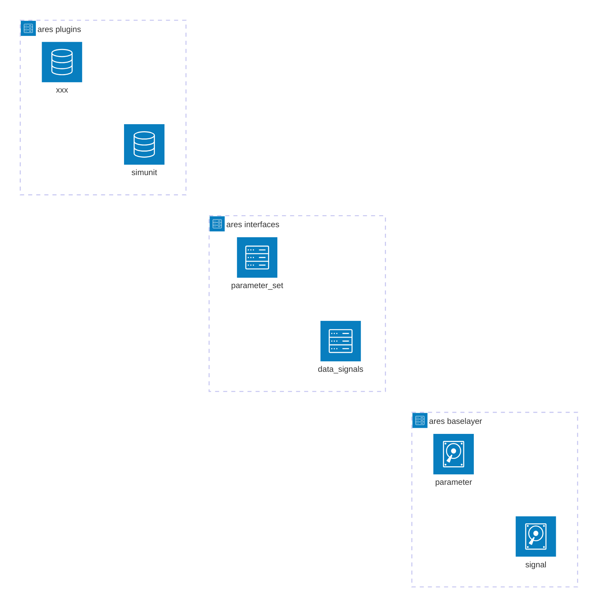
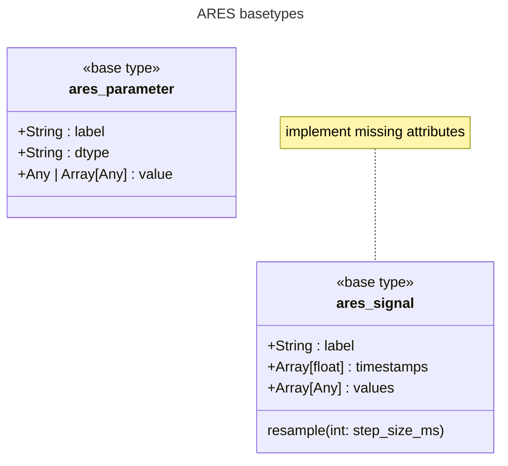
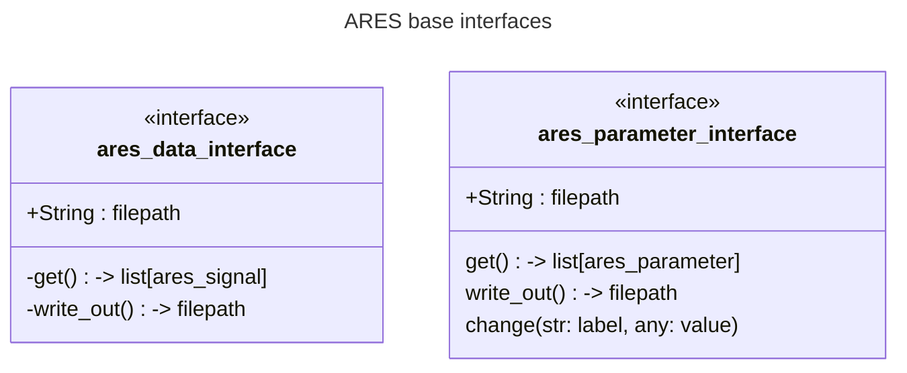
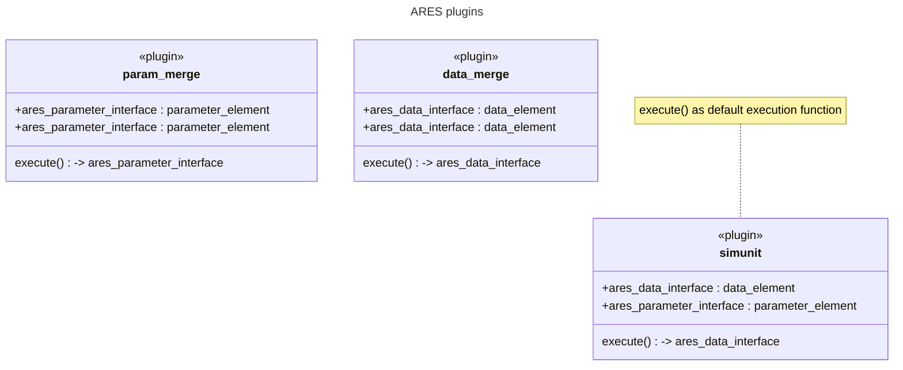

# ARES architecture

## ARES content architecture

```mermaid
  architecture-beta
      group ares_base(server)[ares baselayer]

      service data_element(disk)[signal] in ares_base
      service parameter_element(disk)[parameter] in ares_base

      group ares_interface(server)[ares interfaces]

      service data_interface(server)[data_signals] in ares_interface
      service parameter_interface(server)[parameter_set] in ares_interface


      group ares_plugin(server)[ares plugins]

      service sim_unit(database)[simunit] in ares_plugin
      service custom_plugins(database)[xxx] in ares_plugin
```
## ARES classes

```mermaid
---
title: ARES  basetypes
---
classDiagram
    class ares_signal{
        <<base type>>
        +String : label
        +Array[float] : timestamps
        +Array[Any] : values
        resample(int: step_size_ms)
    }

    note for ares_signal "implement missing attributes"
    class ares_parameter{
        <<base type>>
        +String : label
        +String : dtype
        +Any | Array[Any] : value
    }
```

```mermaid
---
title: ARES  base interfaces
---
classDiagram
    class ares_data_interface{
        <<interface>>
        +String : filepath
        -get() -> list[ares_signal]
        -write_out() -> filepath
    }
    class ares_parameter_interface{
        <<interface>>
        +String : filepath
        get() -> list[ares_parameter]
        write_out() -> filepath
        change(str: label, any: value)
    }
```

```mermaid
---
title: ARES  plugins
---
classDiagram
    note for simunit "execute() as default execution function"
    class simunit{
        <<plugin>>
        +ares_data_interface : data_element
        +ares_parameter_interface : parameter_element
        execute() -> ares_data_interface
    }
    class param_merge{
        <<plugin>>
        +ares_parameter_interface : parameter_element
        +ares_parameter_interface : parameter_element
        execute() -> ares_parameter_interface
    }
    class data_merge{
        <<plugin>>
        +ares_data_interface : data_element
        +ares_data_interface : data_element
        execute() -> ares_data_interface
    }
```
