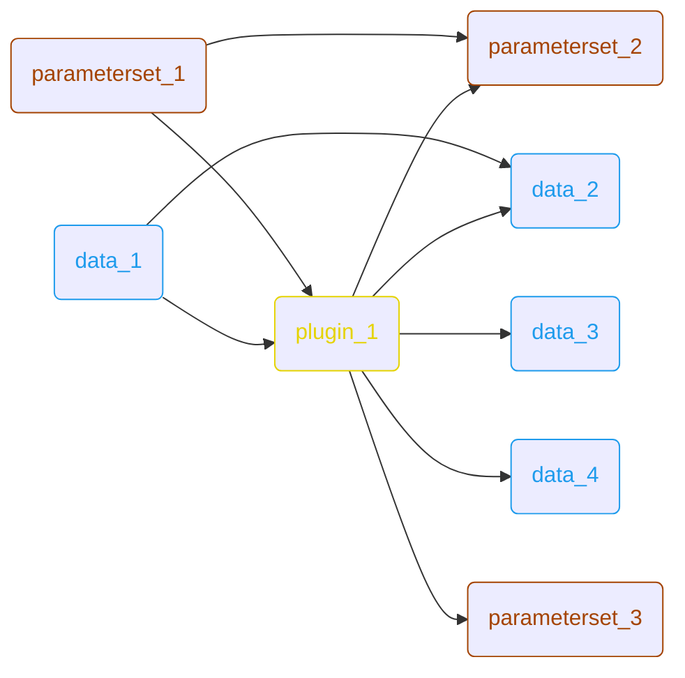
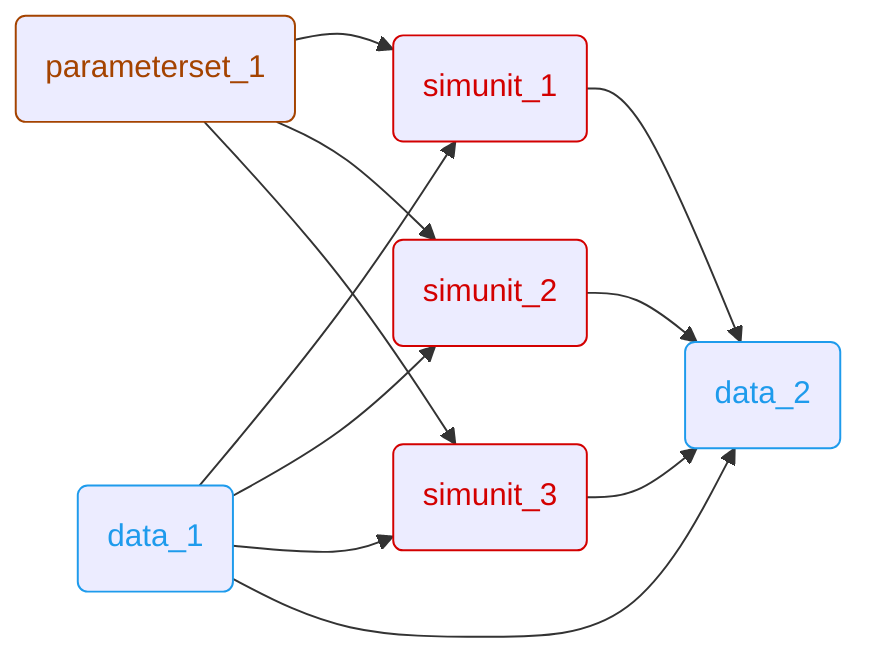

# ARES Examples

This directory contains example workflows and data to demonstrate the capabilities of ARES.

* [1. General Execution Instructions](#1-general-execution-instructions)
    * [1.1. VS Code (Recommended)](#11-vs-code-recommended)
    * [1.2. Command Line Interface (CLI)](#12-command-line-interface-cli)
* [2. Example 1: Custom Plugin & Data Manipulation](#2-example-1-custom-plugin--data-manipulation)
* [3. Example 2: C/C++ Simulation Units](#3-example-2-cc-simulation-units)

## 1. General Execution Instructions

You can run the examples either comfortably via VS Code or manually via the command line.

### 1.1. VS Code (Recommended)

The easiest way to run the examples is using the built-in VS Code launch configurations.

**Prerequisites:**
*   **Make**: Ensure `make` is installed to automatically compile simulation units.

**Steps:**
1.  Open the **Run and Debug** view (Ctrl+Shift+D).
2.  Select the desired configuration (e.g., **ARES example 1**).
3.  Press **F5**.

### 1.2. Command Line Interface (CLI)

To run examples manually, you must first build the required simulation units (C/C++ libraries).

**1. Build Dependencies:**
Run this command from the project root:
```bash
make -C examples/sim_unit all
```

**2. Common Arguments:**
*   `--workflow` / `-wf`: Path to the workflow JSON file.
*   `--output` / `-o`: Directory where output files will be saved.
*   `--log-level`: Logging verbosity (10=DEBUG, 20=INFO, 30=WARNING, 40=ERROR).

## 2. Example 1: Custom Plugin & Data Manipulation

This example demonstrates how to extend ARES using **Custom Plugins** written in Python.

*   **Workflow**: `examples/workflow/workflow_example_1.json`
*   **Key Concepts**:
    *   Reading parameters (`.dcm`) and data (`.mf4`).
    *   Executing a Python plugin (`plugin_example_1.py`) that manipulates the input data and parameters.
    *   The plugin demonstrates combinatorial creation of new data and parameter interfaces, effectively generating new variants based on input combinations.
    *   Writing the modified results back to files.



### Run via CLI
```bash
# Bash/Zsh
source .venv/bin/activate
# Fish: source .venv/bin/activate.fish

python3 -m ares pipeline \
    --workflow examples/workflow/workflow_example_1.json \
    --output examples/output/ \
    --log-level 20
```

## 3. Example 2: C/C++ Simulation Units

This example demonstrates the core capability of ARES: executing compiled **Simulation Units**. It runs three different C/C++ libraries in a sequence.

*   **Workflow**: `examples/workflow/workflow_example_2.json`
*   **Simulation Units**:
    1.  **Derivation**: Calculates the time derivative of input signals.
    2.  **In/Out Handling**: Demonstrates basic signal routing and mapping between the workflow and the simulation unit.
    3.  **Low Pass Filter**: Implements a first-order low-pass filter to process noisy signals.
*   **Key Concepts**:
    *   Integration of compiled shared libraries (`.so` files).
    *   Mapping data signals to simulation inputs via Data Dictionaries (`.json`).
    *   Chaining multiple simulation units where outputs of one can be inputs to another.



### Run via CLI
```bash
# Bash/Zsh
source .venv/bin/activate
# Fish: source .venv/bin/activate.fish

python3 -m ares pipeline \
    --workflow examples/workflow/workflow_example_2.json \
    --output examples/output/ \
    --log-level 20
```
