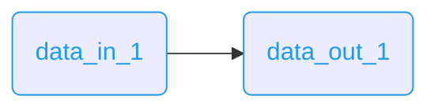
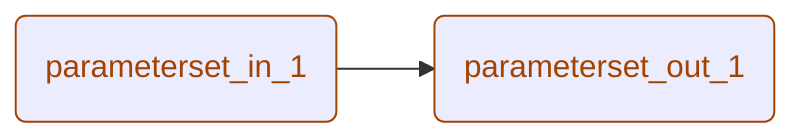
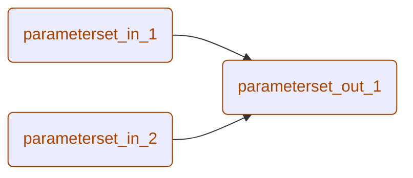
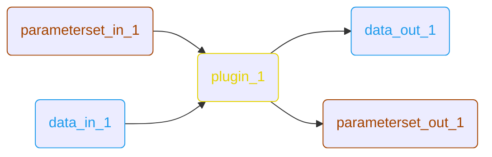
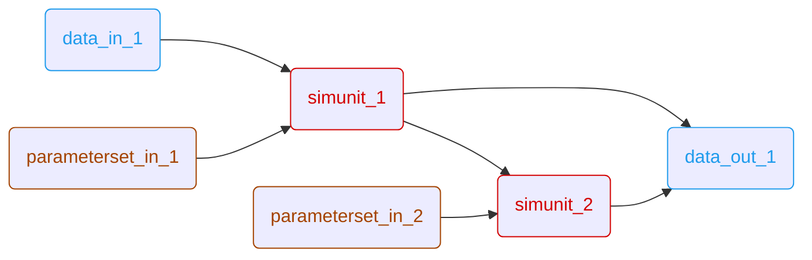
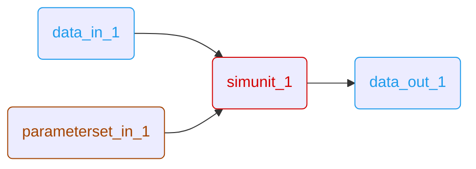
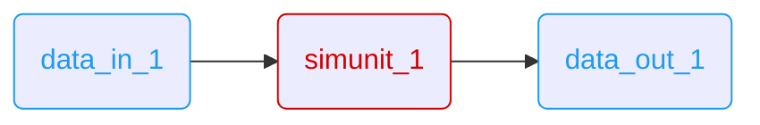

# ARES Examples

This directory contains example workflows and data to demonstrate the capabilities of ARES.

* [1. General Execution Instructions](#1-general-execution-instructions)
    * [1.1. VS Code (Recommended)](#11-vs-code-recommended)
    * [1.2. Command Line Interface (CLI)](#12-command-line-interface-cli)
    * [1.3. Makefile](#13-makefile)
* [2. Data Interface Examples](#2-data-interface-examples)
    * [2.1. Data Caching](#21-data-caching)
    * [2.2. Data Label Filter](#22-data-label-filter)
    * [2.3. Data Resampling](#23-data-resampling)
    * [2.4. Data Conversion (TODO)](#24-data-conversion-todo)
    * [2.5. Data Vertical Stack](#25-data-vertical-stack)
* [3. Parameter Interface Examples](#3-parameter-interface-examples)
    * [3.1. Parameter Caching](#31-parameter-caching)
    * [3.2. Parameter Conversion](#32-parameter-conversion)
    * [3.3. Parameter Label Filter](#33-parameter-label-filter)
* [4. Plugin Examples](#4-plugin-examples)
    * [4.1. Plugin Manipulation](#41-plugin-manipulation)
* [5. Simulation Unit Examples](#5-simulation-unit-examples)
    * [5.1. SimUnit Dependencies](#51-simunit-dependencies)
    * [5.2. SimUnit Interface Standard](#52-simunit-interface-standard)
    * [5.3. SimUnit Interface Alternative](#53-simunit-interface-alternative)
    * [5.4. SimUnit Interface Alternative Default](#54-simunit-interface-alternative-default)
    * [5.5. SimUnit Interface Alternative Value](#55-simunit-interface-alternative-value)
    * [5.6. SimUnit Vertical Stack](#56-simunit-vertical-stack)

## 1. General Execution Instructions

You can run the examples either comfortably via VS Code, via the Makefile, or manually via the command line.

### 1.1. VS Code (Recommended)

The easiest way to run the examples is using the built-in VS Code launch configurations.

**Prerequisites:**
*   **Make**: Ensure `make` is installed to automatically compile simulation units.

**Steps:**
1.  Open the **Run and Debug** view (Ctrl+Shift+D).
2.  Select the desired configuration (e.g., **data_caching**, **simunit_dependencies**).
3.  Press **F5**.

### 1.2. Command Line Interface (CLI)

To run examples manually, you must first build the required simulation units (C/C++ libraries) if running simulation unit examples.

**1. Build Dependencies (for simulation unit examples only):**
Run this command from the project root:
```bash
make -C examples/sim_unit all
```

**2. Common Arguments:**
*   `--workflow` / `-wf`: Path to the workflow JSON file.
*   `--output` / `-o`: Directory where output files will be saved.
*   `--log-level`: Logging verbosity (10=DEBUG, 20=INFO, 30=WARNING, 40=ERROR).

### 1.3. Makefile

All examples can be executed via the Makefile in the `examples/` directory:

```bash
# Run all examples
make -C examples

# Run a specific example
make -C examples data_caching
make -C examples simunit_dependencies
```

Available targets:
- **Data Interface**: `data_caching`, `data_labelfilter`, `data_resampling`, `data_vstack`
- **Parameter Interface**: `param_caching`, `param_convertion`, `param_labelfilter`
- **Plugin**: `plugin_manipulation`
- **Simulation Units**: `simunit_dependencies`, `simunit_interface_alt`, `simunit_interface_alt_default`, `simunit_interface_alt_value`, `simunit_interface_std`, `simunit_vstack`

## 2. Data Interface Examples

These examples demonstrate various data operations such as reading, writing, filtering, and resampling of measurement data files (MF4 format).

### 2.1. Data Caching

*   **Workflow**: `examples/workflow/data_interface/data_caching.wf.json`
*   **Purpose**: Demonstrates the flyweight caching mechanism where identical data files are loaded only once and reused.
*   **Key Concepts**:
    *   Reading multiple MF4 data files.
    *   Automatic caching based on content hash.
    *   Writing cached data to a new output file.



**Run via CLI:**
```bash
python -m ares pipeline \
    --workflow examples/workflow/data_interface/data_caching.wf.json \
    --output examples/output/ \
    --log-level 20
```

### 2.2. Data Label Filter

*   **Workflow**: `examples/workflow/data_interface/data_labelfilter.wf.json`
*   **Purpose**: Filters specific signals from input data files by their label names.
*   **Key Concepts**:
    *   Reading MF4 data files.
    *   Applying label filters to select specific signals.
    *   Writing filtered signals to output.


**Run via CLI:**
```bash
python -m ares pipeline \
    --workflow examples/workflow/data_interface/data_labelfilter.wf.json \
    --output examples/output/ \
    --log-level 20
```

### 2.3. Data Resampling

*   **Workflow**: `examples/workflow/data_interface/data_resampling.wf.json`
*   **Purpose**: Resamples all signals to a common time vector with specified step size.
*   **Key Concepts**:
    *   Reading MF4 data files with different sampling rates.
    *   Resampling to a uniform time vector (stepsize: 2000ms).
    *   Linear interpolation for signal values.


**Run via CLI:**
```bash
python -m ares pipeline \
    --workflow examples/workflow/data_interface/data_resampling.wf.json \
    --output examples/output/ \
    --log-level 20
```

### 2.4. Data Conversion (TODO)

*   **Workflow**: `examples/workflow/data_interface/data_convertion.wf.json`
*   **Purpose**: Convert between different data formats (e.g., MF4 to CSV, HDF5).
*   **Status**: Currently only MF4 format is supported. This example is planned for future implementation.

### 2.5. Data Vertical Stack

*   **Workflow**: `examples/workflow/data_interface/data_vstack.wf.json`
*   **Purpose**: Demonstrates vertical stacking (concatenation) of signals using regex pattern matching to create multi-dimensional arrays.
*   **Key Concepts**:
    *   Reading MF4 data files with signals matching specific naming patterns.
    *   Using regex patterns with capturing groups to identify related signals.
    *   Automatic stacking based on number of groups:
        *   1-2 groups: Stack 1D signals into 2D arrays (columns).
        *   3 groups: Stack 1D signals into 3D arrays (matrices with columns and rows).
    *   Pattern convention: `group(1)` = base name, `group(2)` = column index, `group(3)` = row index.
    *   Writing stacked signals to output with simplified naming.


**Run via CLI:**
```bash
python -m ares pipeline \
    --workflow examples/workflow/data_interface/data_vstack.wf.json \
    --output examples/output/ \
    --log-level 20
```

## 3. Parameter Interface Examples

These examples demonstrate parameter handling operations such as reading, writing, converting between formats (DCM/JSON), and filtering.

### 3.1. Parameter Caching

*   **Workflow**: `examples/workflow/parameter_interface/param_caching.wf.json`
*   **Purpose**: Demonstrates the flyweight caching mechanism for parameter files.
*   **Key Concepts**:
    *   Reading multiple parameter files in different formats (DCM, JSON).
    *   Automatic caching based on content hash.
    *   Merging parameters from multiple sources.
    *   Writing merged parameters to JSON output.



**Run via CLI:**
```bash
python -m ares pipeline \
    --workflow examples/workflow/parameter_interface/param_caching.wf.json \
    --output examples/output/ \
    --log-level 20
```

### 3.2. Parameter Conversion

*   **Workflow**: `examples/workflow/parameter_interface/param_convertion.wf.json`
*   **Purpose**: Convert parameters from DCM format to JSON format.
*   **Key Concepts**:
    *   Reading DCM parameter files.
    *   Writing parameters in JSON format.
    *   Format conversion for better interoperability.


**Run via CLI:**
```bash
python -m ares pipeline \
    --workflow examples/workflow/parameter_interface/param_convertion.wf.json \
    --output examples/output/ \
    --log-level 20
```

### 3.3. Parameter Label Filter

*   **Workflow**: `examples/workflow/parameter_interface/param_labelfilter.wf.json`
*   **Purpose**: Filter specific parameters by their label names.
*   **Key Concepts**:
    *   Reading multiple parameter files (JSON and DCM formats).
    *   Merging parameters from different sources.
    *   Applying label filters to select specific parameters.
    *   Writing filtered parameters to output.



**Run via CLI:**
```bash
python -m ares pipeline \
    --workflow examples/workflow/parameter_interface/param_labelfilter.wf.json \
    --output examples/output/ \
    --log-level 20
```

## 4. Plugin Examples

These examples demonstrate how to extend ARES functionality with custom Python plugins.

### 4.1. Plugin Manipulation

*   **Workflow**: `examples/workflow/plugin/plugin_manipulation.wf.json`
*   **Purpose**: Demonstrates custom Python plugin integration for data and parameter manipulation.
*   **Key Concepts**:
    *   Reading parameters (DCM) and data (MF4).
    *   Executing a Python plugin (`plugin_example_1.py`) that manipulates input data and parameters.
    *   The plugin demonstrates combinatorial creation of new data and parameter interfaces.
    *   Generating multiple output variants based on input combinations.
    *   Writing modified results to files.



**Run via CLI:**
```bash
python -m ares pipeline \
    --workflow examples/workflow/plugin/plugin_manipulation.wf.json \
    --output examples/output/ \
    --log-level 20
```

## 5. Simulation Unit Examples

These examples demonstrate the core capability of ARES: executing compiled C/C++ simulation units with automatic signal and parameter mapping.

### 5.1. SimUnit Dependencies

*   **Workflow**: `examples/workflow/sim_unit/simunit_dependencies.wf.json`
*   **Purpose**: Demonstrates chaining multiple simulation units where outputs from one become inputs to another.
*   **Simulation Units**:
    1.  **Low Pass Filter**: Implements a first-order low-pass filter to process input signals.
    2.  **Derivation**: Calculates the time derivative of the filtered signals.
*   **Key Concepts**:
    *   Integration of compiled shared libraries (.so files).
    *   Chaining simulation units in sequence.
    *   Data flow between simulation units.
    *   Individual parameter sets for each simulation unit.
    *   Different step sizes for each unit (1000ms and 2000ms).



**Run via CLI:**
```bash
# First compile the simulation units
make -C examples/sim_unit derivation
make -C examples/sim_unit lowpassfilterfirstorder

# Then run the workflow
python -m ares pipeline \
    --workflow examples/workflow/sim_unit/simunit_dependencies.wf.json \
    --output examples/output/ \
    --log-level 20
```

### 5.2. SimUnit Interface Standard

*   **Workflow**: `examples/workflow/sim_unit/simunit_interface_std.wf.json`
*   **Purpose**: Demonstrates the standard data dictionary interface for mapping workflow signals to simulation unit inputs/outputs.
*   **Simulation Unit**: **In/Out Handling** - Basic signal routing and parameter handling.
*   **Key Concepts**:
    *   Standard data dictionary mapping (`.dd.json`).
    *   Direct signal name mapping between workflow and simulation unit.
    *   Parameter passing to simulation units.
    *   Signal resampling with defined step size (1000ms).



**Run via CLI:**
```bash
# First compile the simulation unit
make -C examples/sim_unit inout-handling

# Then run the workflow
python -m ares pipeline \
    --workflow examples/workflow/sim_unit/simunit_interface_std.wf.json \
    --output examples/output/ \
    --log-level 20
```

### 5.3. SimUnit Interface Alternative

*   **Workflow**: `examples/workflow/sim_unit/simunit_interface_alt.wf.json`
*   **Purpose**: Demonstrates alternative signal mapping using the data dictionary's `input_alternatives` field for flexible signal routing.
*   **Simulation Unit**: **In/Out Handling**
*   **Key Concepts**:
    *   Alternative data dictionary mapping (`_alt.dd.json`).
    *   Flexible signal name mapping using `input_alternatives` field.
    *   Workflow signals can have different names than simulation unit expects.
    *   No parameter passing (demonstrates signal-only operation).



**Run via CLI:**
```bash
# First compile the simulation unit
make -C examples/sim_unit inout-handling

# Then run the workflow
python -m ares pipeline \
    --workflow examples/workflow/sim_unit/simunit_interface_alt.wf.json \
    --output examples/output/ \
    --log-level 20
```

### 5.4. SimUnit Interface Alternative Default

*   **Workflow**: `examples/workflow/sim_unit/simunit_interface_alt_default.wf.json`
*   **Purpose**: Demonstrates automatic default value handling when signals are not provided by the workflow.
*   **Simulation Unit**: **In/Out Handling**
*   **Key Concepts**:
    *   Standard data dictionary mapping (`.dd.json`).
    *   Missing signals are automatically initialized with default value of 0.
    *   Graceful handling of incomplete input data without explicit configuration.
    *   No parameter passing (demonstrates default signal handling only).


**Run via CLI:**
```bash
# First compile the simulation unit
make -C examples/sim_unit inout-handling

# Then run the workflow
python -m ares pipeline \
    --workflow examples/workflow/sim_unit/simunit_interface_alt_default.wf.json \
    --output examples/output/ \
    --log-level 20
```

### 5.5. SimUnit Interface Alternative Value

*   **Workflow**: `examples/workflow/sim_unit/simunit_interface_alt_value.wf.json`
*   **Purpose**: Demonstrates mapping constant values from the `input_alternatives` field instead of workflow signals.
*   **Simulation Unit**: **In/Out Handling**
*   **Key Concepts**:
    *   Alternative data dictionary with constant values (`_alt_value.dd.json`).
    *   Constant values specified in the `input_alternatives` field of the data dictionary.
    *   The first entry in `input_alternatives` is mapped as constant value for each signal.
    *   Allows defining fixed calibration values or test constants directly in the data dictionary.
    *   Simulation unit receives constant values instead of time-varying signals from workflow.
    *   No parameter passing (demonstrates constant value handling only).


**Run via CLI:**
```bash
# First compile the simulation unit
make -C examples/sim_unit inout-handling

# Then run the workflow
python -m ares pipeline \
    --workflow examples/workflow/sim_unit/simunit_interface_alt_value.wf.json \
    --output examples/output/ \
    --log-level 20
```

### 5.6. SimUnit Vertical Stack

*   **Workflow**: `examples/workflow/sim_unit/simunit_vstack.wf.json`
*   **Purpose**: Demonstrates vertical stacking of signals in combination with simulation unit execution.
*   **Simulation Unit**: **In/Out Handling** - Signal routing with multi-dimensional input arrays.
*   **Key Concepts**:
    *   Reading MF4 data files with signals matching vstack patterns.
    *   Automatic stacking of related signals before simulation unit execution.
    *   Passing multi-dimensional arrays (2D/3D) to simulation units.
    *   Processing stacked signals through simulation unit.
    *   Writing processed results to output.


**Run via CLI:**
```bash
# First compile the simulation unit
make -C examples/sim_unit inout-handling

# Then run the workflow
python -m ares pipeline \
    --workflow examples/workflow/sim_unit/simunit_vstack.wf.json \
    --output examples/output/ \
    --log-level 20
```
